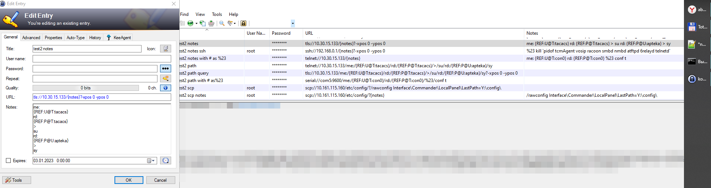
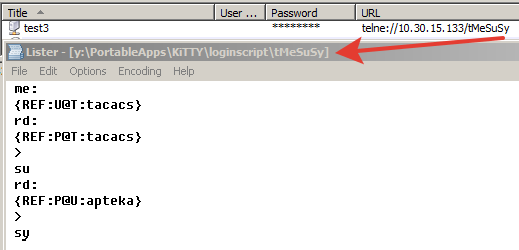
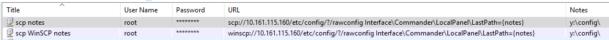

# KeePassURLOverride
[KeePass](https://keepass.info) [URL Override](https://keepass.info/help/base/autourl.html#override) for [KiTTY](https://github.com/cyd01/KiTTY) and [WinSCP](https://github.com/winscp/winscp)
## Credits
- [Dominik Reichl](https://keepass.info) - for KeePass
- [Cyril as Cyd](https://github.com/cyd01/KiTTY) - for KiTTY
- [Martin Přikryl](https://github.com/winscp/winscp) - for WinSCP
## Usage
- Look usage [KiTTY](KiTTY.en.md), [WinSCP](WinSCP.en.md), [URL Override](https://winscp.net/eng/docs/integration_keepass)
- Смотри использование [KiTTY](KiTTY.ru.md), [WinSCP](WinSCP.ru.md)
## 
## Usage2
- Look usage2 [KiTTY](KiTT.en.md), [WinSCP](https://winscp.net/forum/viewtopic.php?p=115210#115210)
- Смотри использование2 [KiTTY](KiTT.ru.md)
## 
## 
